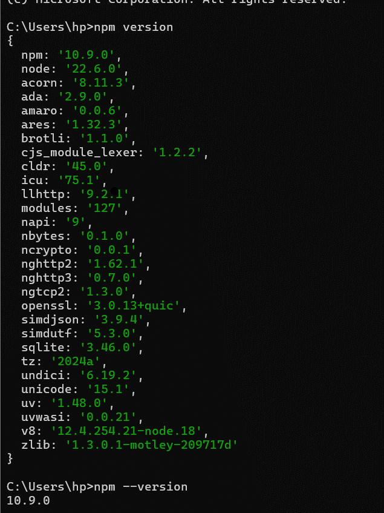
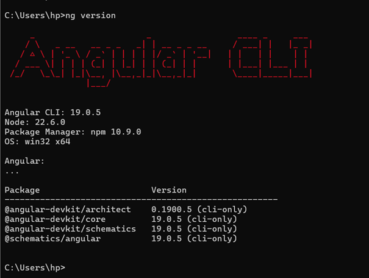
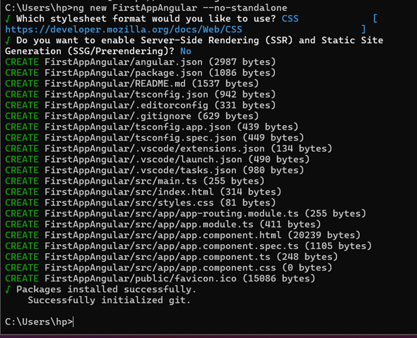
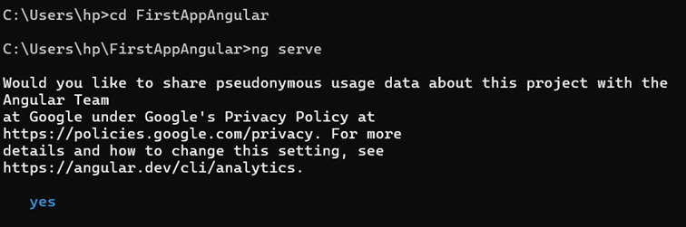
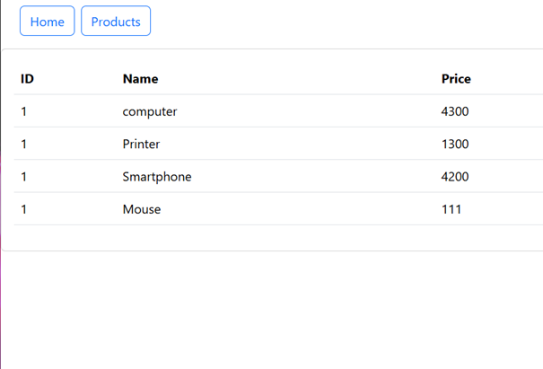
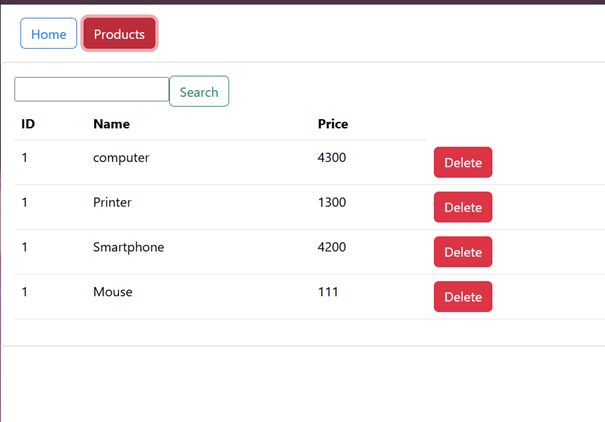
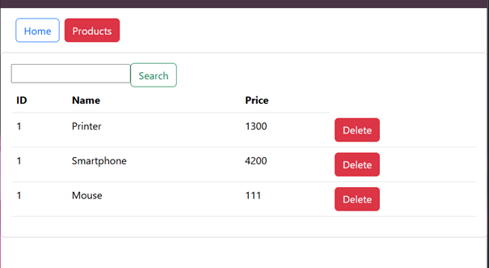
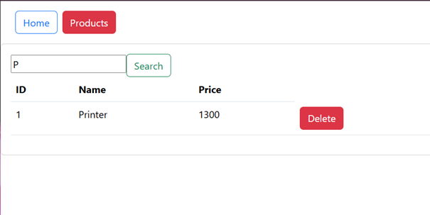
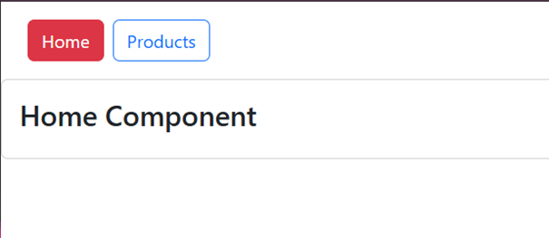

<h1>verification et l'installation de angular</h1>

<h1>verification de la version angular </h1>

<h1>creation de l'app</h1>

<h1>acceder a l'app et demarrer le serveur</h1>

<h1> table de produit</h1>

<h1>suppression d'un produit</h1>

<h1>chercher un produit</h1>

<h1>page home</h1>

